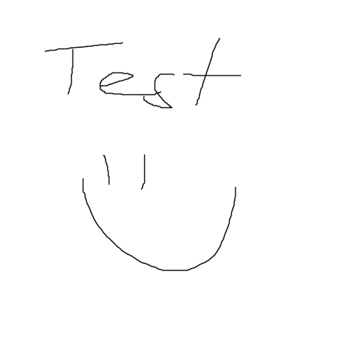
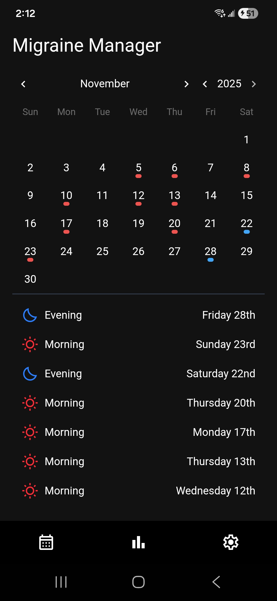
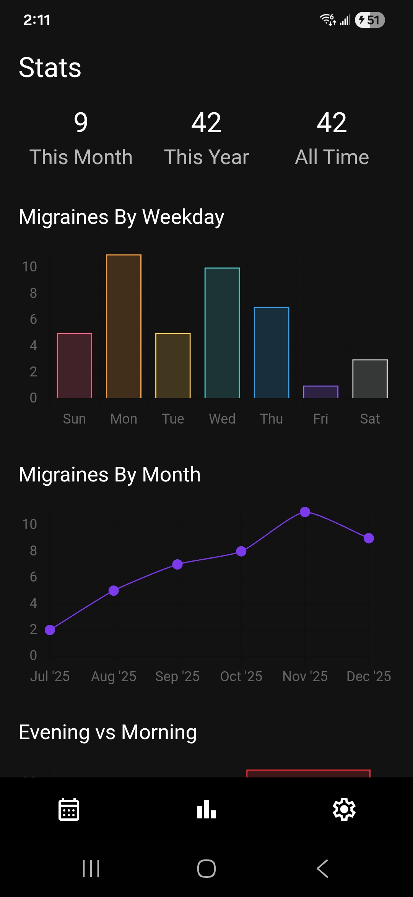

# Migraine Manager



## About

I suffer from migraines and previously I used a text document to track my migraines. This worked, but I wanted to get more info, like common days, or overall migraines in a given month. I decided to build an android app using Capacitor to allow me to track my migraines.

## Features

- Simple calendar for logging migraine events (morning/evening)
- Data visualization with charts (day of week, month, type)
- CSV export and import (backup/restore your data)
- Local storage for privacy (no cloud sync)
- Toast notifications for feedback
- Works as a PWA and as a native Android app

## Screenshots




## Requirements

- Node.js ^24.11.1
- Java ^24.0.1 (for Android build)

## Setup

Run locally

```bash
npm install
npm run start
```

Build for Android:

```bash
npm install
npx cap add android
npm run build

# This can be used to install the app directly on an android device connected to the PC
npm run build-and-send
```

## Credits

These are some of the tools used:

- [Vue 3](https://vuejs.org/)
- [Pinia](https://pinia.vuejs.org/)
- [Capacitor](https://capacitorjs.com/)
- [Quasar](https://quasar.dev/)
- [Chart.js](https://www.chartjs.org/)
- [dayjs](https://day.js.org/)
- [@meforma/vue-toaster](https://github.com/meforma/vue-toaster).

## License

Personal project. No license. Use at your own risk.
